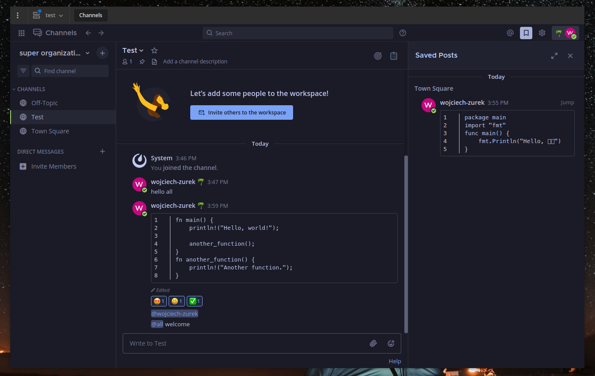

# Tokyo Night Mattermost Theme

* Open Mattermost
* Account Settings
* Display
* Custom Theme
* Paste the code

```json
{"awayIndicator":"#ff9e64","buttonBg":"#7aa2f7","buttonColor":"#1a1b26","centerChannelBg":"#1a1b26","centerChannelColor":"#c0caf5","codeTheme":"tokio-night","dndIndicator":"#f7768e","errorTextColor":"#f7768e","linkColor":"#7aa2f7","mentionBg":"#414868","mentionBj":"#cfc9c2","mentionColor":"#a9b1d6","mentionHighlightBg":"#414868","mentionHighlightLink":"#7aa2f7","newMessageSeparator":"#ff9e64","onlineIndicator":"#9ece6a","sidebarBg":"#1a1b26","sidebarHeaderBg":"#1a1b26","sidebarHeaderTextColor":"#a9b1d6","sidebarTeamBarBg":"#1a1b26","sidebarText":"#a9b1d6","sidebarTextActiveBorder":"#9ece6a","sidebarTextActiveColor":"#7aa2f7","sidebarTextHoverBg":"#414868","sidebarUnreadText":"#c0caf5"}
```

* Save

# Screenshot


